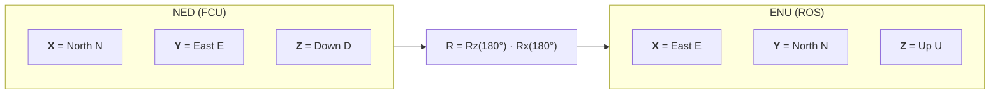
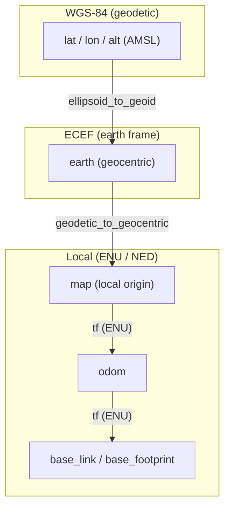
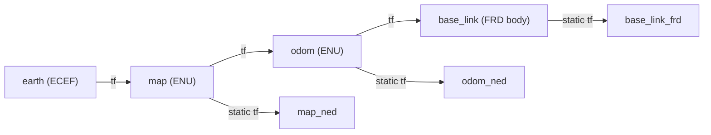

Coordinate Frames
=================

MAVROS translates the Aerospace NED frames used in flight controllers to ROS ENU
frames and vice-versa.

- For translating airframe related data we simply apply a rotation of 180° about
  the ROLL (X) axis.
- For local frames we apply 180° about the ROLL (X) axis and 90° about the YAW
  (Z) axis.

The two rotations combine into a single transform that maps the NED frame onto
the ENU frame:

Where `Rx(180°)` flips the vertical axis (Down ↔ Up) and swaps the horizontal
pair, and `Rz(180°)` swaps the two horizontal axes to finish the mapping.

Please read documents from [issue #473][iss473] for additional information.

All the conversions are handled in `mavros/src/lib/ftf_frame_conversions.cpp` and
`mavros/src/lib/ftf_quaternion_utils.cpp`, and are tested in
`mavros/test/test_frame_conversions.cpp` and
`mavros/test/test_quaternion_utils.cpp` respectively.

Related issues: [#49 (outdated)][iss49], [#216 (outdated)][iss216], [#317 (outdated)][iss317],
[#319 (outdated)][iss319], [#321 (outdated)][iss321], [#473][iss473].
Documents: [Frame Conversions][iss473rfc], [MAVLink coordinate frames][iss473table].

Geodetic / geocentric conversions
---------------------------------

MAVROS also allows conversion of geodetic and geocentric coordinates through
[GeographicLib][geolib], given that:

  - `geographic_msgs` and `NavSatFix.msg` require the LLA fields to be filled in
    WGS-84 datum, meaning that the altitude should be the height above the WGS-84
    ellipsoid. For that, a conversion from the height above the geoid (AMSL,
    considering the egm96 geoid model) to height above the WGS-84 ellipsoid, and
    vice-versa, is available and used in several plugins;
  - According to ROS REP 105, the `earth` frame should be propagated in ECEF
    (Earth-Centered, Earth-Fixed) local coordinates. For that, the functionalities
    of GeographicLib are used in order to allow conversion from geodetic coordinates
    to geocentric coordinates;
  - The translation from GPS coordinates to local geocentric coordinates requires
    the definition of a local origin on the `map` frame, in ECEF, and calculating
    the offset to it in ENU. All the conversions are supported by GeographicLib
    classes and methods and implemented in the `global_position` plugin.

The relationships between the geodetic, ECEF and local frames follow
[REP 105](https://www.ros.org/reps/rep-0105.html):

The `global_position` plugin uses [GeographicLib][geolib] to convert between the
geodetic (AMSL) and geocentric (ECEF) representations, and the standard `tf`
tree then carries the local ENU frames.

Default TF frames
-----------------

!!! tip "See also"
    [ROS 2 tf2](https://docs.ros.org/en/lyrical/Concepts/Intermediate/About-Tf2.html)

MAVROS publishes a `tf` tree following [REP 105](https://www.ros.org/reps/rep-0105.html).
The frame ids are configurable per plugin via parameters; the defaults are:

| Frame | Default | Used for |
|-------|---------|----------|
| `earth` | `earth` | Global (ECEF) reference; parent of `map` |
| `map` | `map` | World-fixed local origin (ENU) |
| `odom` | `odom` | Drift-free local frame (ENU), parent of `base_link` |
| `base_link` | `base_link` | Body-fixed frame attached to the vehicle |

The links `_ned` and `_frd` are published between the corresponding ENU frames
and their NED / FRD (body) counterparts:

Defaults are set by the `global_position`, `local_position` and `imu` plugins:

- `global_position.tf.frame_id` = `map`, `tf.global_frame_id` = `earth`,
  `tf.child_frame_id` = `base_link`
- `local_position.tf.frame_id` = `map`, `tf.child_frame_id` = `base_link`
- `imu.frame_id` = `base_link`

See the [plugin reference](plugins/index.md) for the full parameter list of each
plugin.

[iss49]: https://github.com/mavlink/mavros/issues/49
[iss216]: https://github.com/mavlink/mavros/issues/216
[iss317]: https://github.com/mavlink/mavros/issues/317
[iss319]: https://github.com/mavlink/mavros/issues/319
[iss321]: https://github.com/mavlink/mavros/issues/321
[iss473]: https://github.com/mavlink/mavros/issues/473
[iss473rfc]: https://docs.google.com/document/d/1bDhaozrUu9F915T58WGzZeOM-McyU20dwxX-NRum1KA/edit
[iss473table]: https://docs.google.com/spreadsheets/d/1LnsWTblU92J5_SMinTvBvHJWx6sqvzFa8SKbn8TXlnU/edit#gid=0
[geolib]: https://geographiclib.sourceforge.io/