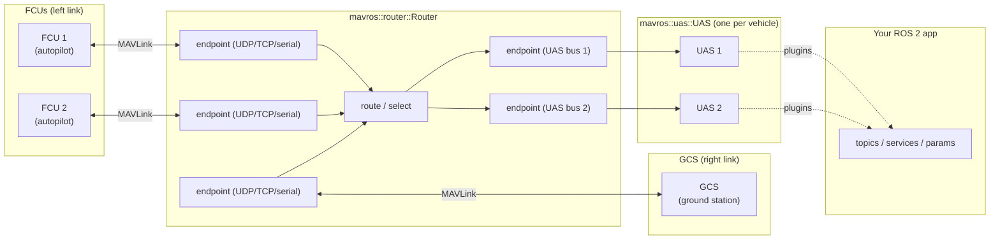

Nodes and Launch
================

MAVROS is composed of a set of *composable nodes* that can be run either as a
single all-in-one container or loaded individually into a component container.

The Router acts as a MAVLink switch between the external links (FCU, GCS) and
the UAS nodes, which in turn host the plugins that translate MAVLink to ROS 2:



- **Router** owns the raw transport endpoints and routes MAVLink messages between
  them. A typical setup has **one GCS and one or several FCUs** (e.g. multiple
  autopilots on the same link), and endpoints can be added/removed at runtime
  (services `~/add_endpoint`, `~/del_endpoint`).
- **UAS** subscribes to a single "UAS link" endpoint on the Router and hosts the
  plugins. You normally run **one UAS per vehicle**, each with its own set of
  plugins; each plugin handles specific MAVLink messages and exposes the
  corresponding ROS 2 topics, services and parameters.

Composite nodes
---------------

!!! tip "See also"
    [ROS 2 node composition](https://docs.ros.org/en/lyrical/Concepts/Intermediate/About-Composition.html)

### mavros::router::Router

This is the router node required to support connections to FCU(s), GCS(es) and
UAS nodes. The Router allows you to add/remove endpoints on the fly without node
restart.

#### Parameters

- `fcu_urls` (list of strings, default `[]`) - connection URLs for flight
  controllers, e.g. `["udp://0.0.0.0:14540@"]`.
- `gcs_urls` (list of strings, default `[]`) - connection URLs for ground
  stations, e.g. `["udp://127.0.0.1:14555@"]`.
- `uas_urls` (list of strings, default `[]`) - UAS link URLs, one per UAS/
  vehicle, e.g. `["/uas1", "/uas2"]`.

#### Services

- `~/add_endpoint` [type: [mavros_msgs::srv::EndpointAdd](https://docs.ros.org/en/rolling/p/mavros_msgs/srv/EndpointAdd.html)] - add a runtime endpoint
  without restarting the node.
- `~/del_endpoint` [type: [mavros_msgs::srv::EndpointDel](https://docs.ros.org/en/rolling/p/mavros_msgs/srv/EndpointDel.html)] - remove a runtime endpoint.

#### Topics

- `mavlink_source` / `mavlink_sink` - raw MAVLink frames ([mavros_msgs::msg::Mavlink](https://docs.ros.org/en/rolling/p/mavros_msgs/msg/Mavlink.html))
  used to connect to each UAS node over the UAS bus.

#### Diagnostics

The Router exposes a `MAVROS Router` diagnostic task with the routed/sent/dropped
message counters.

#### Message routing

The Router forwards MAVLink between endpoints with these rules:

1. FCU broadcast → GCS, UAS, but not to any other FCU.
2. FCU targeted system/component → GCS/UAS endpoint with matching address.
3. FCU targeted system → delivered to every GCS/UAS endpoint that has matched that system id, regardless of component.
4. GCS broadcast → FCU, UAS.
5. GCS targeted → FCU/UAS with matching address.
6. UAS broadcast → FCU, GCS.
7. UAS targeted → FCU/GCS.

### mavros::uas::UAS

This node is a plugin container which manages all the protocol plugins. Each
plugin is a subnode of this node.

#### Parameters

- `uas_url` (string, default `/uas1`) - UAS link URL used to connect to the Router.
- `fcu_protocol` (string, default `v2.0`) - MAVLink protocol version.
- `system_id` (int, default `1`) - MAVLink system id of this UAS.
- `component_id` (int, default `191`) - MAVLink component id of this UAS
  (`MAV_COMP_ID_ONBOARD_COMPUTER`).
- `target_system_id` (int, default `1`) - MAVLink system id of the FCU.
- `target_component_id` (int, default `1`) - MAVLink component id of the FCU.
- `plugin_allowlist` (list of strings) - only load plugins matching these patterns.
- `plugin_denylist` (list of strings) - do not load plugins matching these patterns.
- `base_link_frame_id` (string, default `base_link`) - body-fixed tf frame.
- `odom_frame_id` (string, default `odom`) - odometry tf frame.
- `map_frame_id` (string, default `map`) - world-fixed tf frame.

#### Topics

- `mavlink_sink` / `mavlink_source` - raw MAVLink frames ([mavros_msgs::msg::Mavlink](https://docs.ros.org/en/rolling/p/mavros_msgs/msg/Mavlink.html))
  connecting this UAS to the Router's UAS bus.

#### Diagnostics

The UAS exposes a `MAVROS UAS` diagnostic task (hardware id `uas://<uas_url>`).

#### Plugin loading

Plugins are loaded via `pluginlib`. If `plugin_allowlist` is non-empty, `*` is
added to `plugin_denylist` unless it is already present, so only allowlisted
plugins are loaded. Loading decisions are made at startup; unmatched patterns are
reported with a warning.

Programs
--------

### mavros_node -- all-in-one container

That is a preconfigured composite node container, which provides similar
parameters as the ROS1 `mavros_node`. That container loads the Router, the UAS
and configures them to work together (sets `uas_link`, etc.).

This is the main node. You can disable the GCS proxy by setting an empty URL.

    ros2 run mavros mavros_node --ros-args --params-file params.yaml

Executors
---------

!!! tip "See also"
    [ROS 2 executors](https://docs.ros.org/en/lyrical/Concepts/Intermediate/About-Executors.html)

MAVROS builds its executors via a factory that honors two environment variables:

  - `MAVROS_EXECUTOR_TYPE` - executor used by both the `mavros_node` container and
    the UAS plugin executor:
      - `mt` (default) - `rclcpp::executors::MultiThreadedExecutor`
      - `events` (alias `cbg`) - the Callback Group Events executor
        ([Concept docs](https://docs.ros.org/en/lyrical/Concepts/Intermediate/About-Executors.html#the-callback-group-events-executor),
        [`rclcpp::executors::EventsCBGExecutor`](https://docs.ros.org/en/rolling/p/rclcpp/generated/classrclcpp_1_1executors_1_1EventsCBGExecutor.html)),
        available only on Lyrical+
        (rclcpp >= 30.0.0). On older distros the request is ignored with a
        warning and `MultiThreadedExecutor` is used.
  - `MAVROS_UAS_EXECUTOR_THREADS` - number of threads for the UAS plugin
    executor (default: clamped hardware concurrency, min 2 max 4; must be
    >= 2 if set).

Example, running `mavros_node` with the events executor:

    MAVROS_EXECUTOR_TYPE=events ros2 run mavros mavros_node

When MAVROS is used as composable nodes inside a component container, the
container's executor is chosen with the container's own `--executor-type`
argument instead; see the composable launch below.

Launch files
------------

!!! tip "See also"
    [ROS 2 launch](https://docs.ros.org/en/lyrical/Concepts/Basic/About-Launch.html)

Launch files are provided for use with common FCUs, in particular
[Pixhawk](https://pixhawk.org/):

  - [px4.launch](https://github.com/mavlink/mavros/blob/master/mavros/launch/px4.launch) - for use with the PX4 Autopilot
    (for VTOL, multicopters and planes)
  - [apm.launch](https://github.com/mavlink/mavros/blob/master/mavros/launch/apm.launch) - for use with ArduPilot flight stacks
    (e.g. all versions of ArduPlane, ArduCopter, …)
  - [test_compose.launch.py](https://github.com/mavlink/mavros/blob/master/mavros/launch/test_compose.launch.py) - loads
    `mavros::router::Router` and one or two `mavros::uas::UAS` nodes as composable
    nodes into a component container.

`test_compose.launch.py` accepts:

  - `fcu_url` (default `udp://0.0.0.0:14540@`) - FCU connection URL
  - `gcs_url` (default `udp://127.0.0.1:14555@`) - GCS connection URL
  - `executor` (default `mt`) - container executor: `mt`, `events`, or `auto`
    (`events` on Lyrical+, `mt` otherwise). The events (Callback Group
    Events) executor support inside a component container is still immature
    upstream (ros2/rclcpp#3186), so the reliable `component_container_mt` is
    the default.

Example:

    ros2 launch mavros test_compose.launch.py fcu_url:=udp://@192.168.60.192:15000 executor:=events

Components can also be loaded/unloaded at runtime against a running container:

    ros2 component load /mavros_container mavros mavros::router::Router
    ros2 component load /mavros_container mavros mavros::uas::UAS
    ros2 component unload /mavros_container <component_uid>

Examples:

    ros2 launch mavros px4.launch
    ros2 launch mavros apm.launch fcu_url:=tcp://localhost gcs_url:=udp://@


Extra nodes (mavros_extras)
---------------------------

In addition to the plugins, `mavros_extras` ships a few standalone nodes.

### terrain_server

A Python ROS 2 node that serves SRTM elevation data to the FCU over the MAVLink
[terrain protocol](https://mavlink.io/en/services/terrain.html). It is the
companion to the `terrain` plugin (see
[terrain plugin](plugins/extras/terrain.md)): the plugin forwards
`TERRAIN_REQUEST` from the FCU to this node, which looks up `.hgt` SRTM tiles and
publishes `TERRAIN_DATA` blocks back.

```shell
ros2 run mavros_extras terrain_server
```

The node publishes `~/terrain/data`, subscribes to `~/terrain/request`, and
offers a `~/terrain/check` service for point elevation queries.

Parameters:

  - `terrain_data_path` (default `""`) - directory for the `.hgt` tile cache;
    empty defaults to `~/.cache/mavros/terrain/<srtm_source>/`.
  - `auto_download` (default `false`) - automatically download missing SRTM
    tiles in background threads.
  - `srtm_data_url` (default `https://terrain.ardupilot.org`) - SRTM tile
    download base URL (use `http://` for Squid/nginx cacheability).
  - `srtm_source` (default `SRTM3`) - SRTM dataset (`SRTM3` = 3 arc-second,
    `SRTM1` = 1 arc-second).
  - `send_rate_hz` (default `5.0`) - rate at which `TERRAIN_DATA` blocks are
    sent to the FCU.
  - `max_cache_tiles` (default `64`) - maximum tiles kept in the in-memory LRU
    cache.
  - `proxy` (default `""`) - HTTP/HTTPS proxy for tile downloads; empty uses
    environment variables.

The same executable also provides tile-cache management CLI subcommands:

```shell
ros2 run mavros_extras terrain_server preload LAT1 LON1 LAT2 LON2
ros2 run mavros_extras terrain_server update
ros2 run mavros_extras terrain_server validate
```

### servo_state_publisher

A composable C++ node (class `mavros::extras::ServoStatePublisher`) that converts
`mavros_msgs/RCOut` PWM channel values into `sensor_msgs/JointState`, mapping RC
channels to URDF joints. It is useful to bind a URDF model to real servos.

```shell
ros2 run mavros_extras servo_state_publisher
```

It can also be loaded into a component container:

```shell
ros2 component load <container> mavros_extras mavros::extras::ServoStatePublisher
```

It subscribes to:

  - `robot_description` - the URDF model (as published by `robot_state_publisher`).
  - `rc_out` - PWM output (`mavros_msgs/RCOut`).

And publishes `joint_states` (`sensor_msgs/JointState`).

Configuration is given in a single `config` parameter (a YAML mapping of joint
name to RC channel settings). See the example below and the shipped
[servo\_state\_publisher.yaml](https://github.com/mavlink/mavros/blob/master/mavros_extras/launch/servo_state_publisher.yaml):

```yaml
aileron:
  rc_channel: 1
  rc_min: 1000    # from RCx_MIN/MAX/TRIM
  rc_max: 2000
  rc_trim: 1500
throttle:
  rc_channel: 3
  rc_rev: true    # reverse direction
```

Each servo entry supports:

  - `rc_channel` (required) - RC channel number (1-based).
  - `rc_min` / `rc_max` (defaults `1000` / `2000`) - PWM range.
  - `rc_trim` (default midpoint of `rc_min`/`rc_max`) - center PWM.
  - `rc_dz` (default `0`) - dead zone around trim.
  - `rc_rev` (default `false`) - reverse channel direction.

The URDF joint must exist and define `<limit>`.